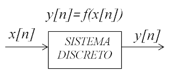

## Filtros Digitais aplicados em Finanças: Filtrando a curva do Par USD/JPY

Há um tempo atrás eu vi um analista quant (não lembro se era da Encore ou da Giant Steps) comentando que leu um artigo de telecomunicações e teve a ideia de tentar aplicar um filtro, encontrado no artigo, na curva de câmbio USD/BRL. Mais recentemente, no artigo de Shternshis et al. (2022), vi novamente uma proposta de filtro para remoção de sazonalidade, efeitos espúrios e ruídos microestruturais de dados financeiros. Então fiquei com vontade de estudar a aplicação de diferentes filtros em finanças.

Cabe falar que a área de design de filtros digitais é uma área extensa e em contínuo desenvolvimento. Aqui minha proposta é estudar filtros digitais clássicos: **Média Móvel**, **Filtro Butterworth**, **Filtro Chebyshev** e um **filtro FIR generalizado**. Mas deixo claro que existem inúmeros filtros e combinações de filtros que podem ser úteis em finanças.

Como ex-estudante de engenharia, vou abordar o tema de filtros como um tópico do estudo de sinais e sistemas.

### Objetivo
Neste trabalho exploraremos a aplicação de filtros passa-baixas em um sinal financeiro.

### Sinais e Sistemas

Um **Sinal** é um conjunto de dados ou informação. Esse conjunto pode ser contínuo, $x(t)$, ou discreto, $x[n]$. Um sinal que depende do tempo pode ser comumente chamado de série temporal.

Sinais, em geral, podes ser processados por **Sistemas**, os quais podem modificá-los ou extrair informações. Matemáticamente escrevemos $y(t) = f(x(t))$ para sinais contínuos ou $y[n] = f(x[n])$ para sistemas discretos. Graficamente podemos representar da seguinte forma.

Ainda é possível representar um sistema fisicamente. Um circuito elétrico, por exemplo, é um sistema.

### Filtros

Um **Filtro** então é um sistema que recebe um sinal de entrada e o modifica. Tá, mas esse filtro filtra o que? Frequências. Acontece que um sinal pode ser enxergado como uma soma de sinais com diferentes frquências (Isso é muito interessante, mas não vou aprofundar aqui. Veja [Séries de Fourier](https://en.wikipedia.org/wiki/Fourier_series)). **Quando aplicamos um filtro a esse sinal, conseguimos, a grosso modo, retirar algumas frequências (ou, de outro ponto de vista, ressaltar frequências)**.

Quanto a banda de passagem, existem 4 tipos de filtros:
* Passa-baixas, permite a passagem das componentes de baixa frequência (ou, elimina as componentes de alta frequência);
* passa-altas, permite a passagem das componentes de alta frequência (ou, elimina as componentes de baixa frequência);
* passa-banda, permite a passagem de componentes em um *range* específico de frequências (ou, elimina as componentes fora desse *range*);
* rejeita-banda, permite a passagem de componentes fora de um *range* específico de frequências (ou, elimina as componentes dentro desse *range*).

De maneira simplificada, **podemos enxergar um sinal temporal financeiro como uma soma de sinais de baixa frequência (variações trimestrais, por exemplo) e sinais de alta frequência (variações diárias, por exemplo).** Dessa forma, ao aplicar um filtro conseguimos "eliminar" algumas dessas frequências. 

Neste trabalho, queremos enxergar tendências de longo prazo no nosso sinal financeiro e, para isso, retiramos as componentes de alta frequência (que podem ser consideradas ruído). Para isso, aplicarei alguns filtros **passa-baixas** e avaliarei os resultados de cada um. 

### Referências
1. [Oppenheim]

### Sumário

1. [Tratando os Dados](#tratandoosdados)
2. [Filtros](#filtros)
   1. [Filtros FIR](#fir)
      1. [Média Móvel](#mm)
